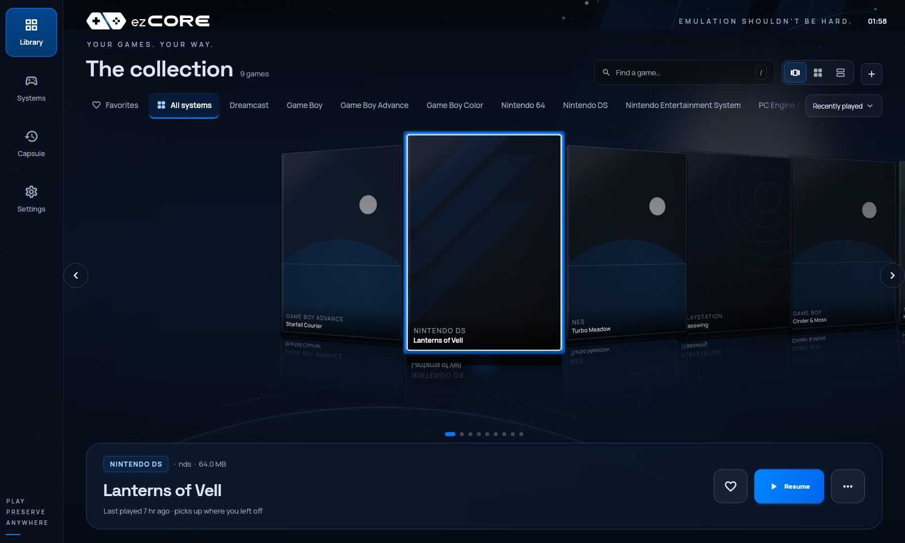
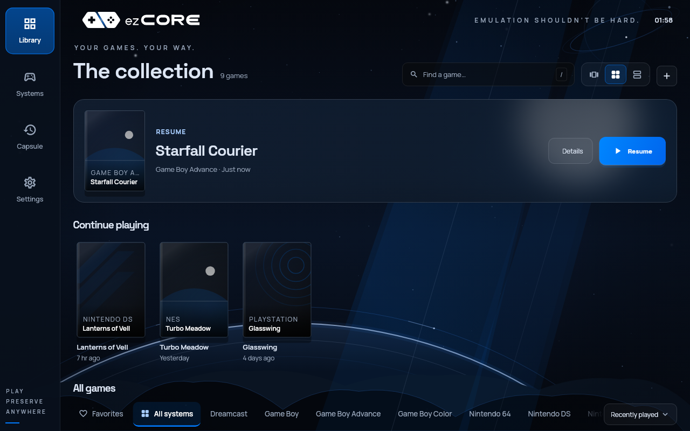
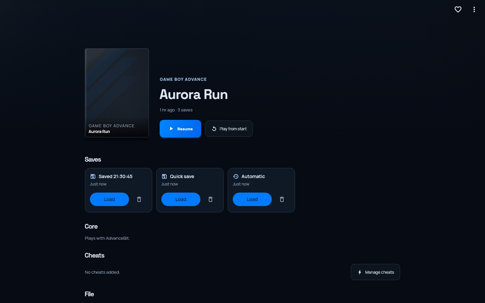
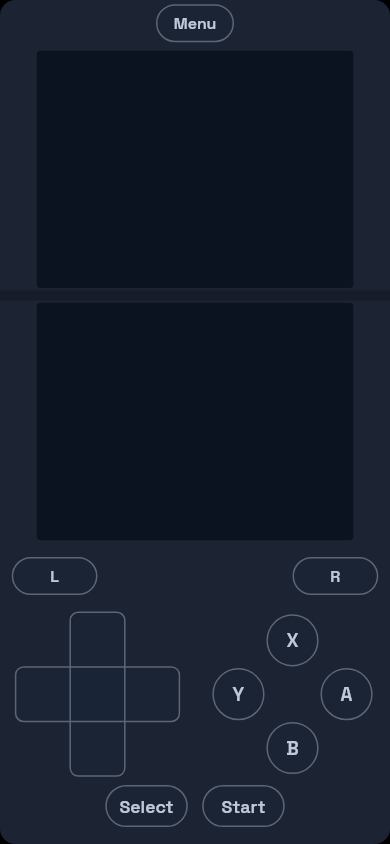
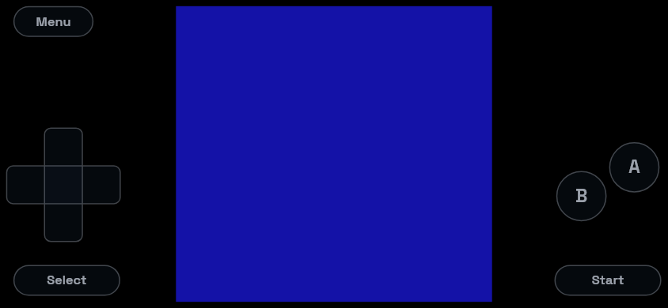

<p align="center">
  <picture>
    <source media="(prefers-color-scheme: dark)" srcset="assets/branding/lockup-light.png">
    <source media="(prefers-color-scheme: light)" srcset="assets/branding/lockup-dark.png">
    
  </picture>
</p>

<h1 align="center">Every game you own. One app. Zero menus.</h1>

<p align="center">
  <strong>ezCORE is an open-source home for emulation — your whole library,<br>
  every system, every save, one tap from the couch.</strong>
</p>

<p align="center">
  <a href="https://github.com/0xJ1nn/ezcore/releases">
    
  </a>
  <a href="LICENSE">
    
  </a>
  
  <a href="https://github.com/sponsors/0xJ1nn">
    
  </a>
</p>

<p align="center">
  <a href="#take-a-tour">Tour</a> ·
  <a href="#the-lineup">Systems</a> ·
  <a href="#download">Download</a> ·
  <a href="#the-big-idea-cores-are-apps">Cores are apps</a> ·
  <a href="#roll-your-own-build">Build</a> ·
  <a href="#contributing">Contribute</a>
</p>

<p align="center">
  
</p>

---

## The pitch

You own games on a dozen systems. Playing them shouldn't mean twelve apps,
twelve settings menus, and twelve folders of saves. ezCORE replaces the pile
with one front door:

- **It remembers for you.** Open the app and you land on the last game you
  played, exactly where you left off — no ROM hunting, no core picking.
- **It organizes for you.** Point it at a folder and it identifies every game,
  sorts it by system, and builds a shelf you can actually browse.
- **It adapts to you.** On-screen controls shaped per console, controllers
  you can remap in seconds, a pause menu that never kicks you out.
- **It forgives you.** Every save is a card you can reload. Crash protection
  keeps one bad core from taking down your library, your saves, or the app.

---

## Take a tour

### Resume. Just press play.

ezCORE opens on the game you played last — *any* system — and puts you back
where you stopped. The decision fatigue is gone. Browse the shelf with the
arrow keys, the mouse wheel, a swipe, or a controller's d-pad.

<p align="center">
  
</p>

### One library, every system.

Add a file or drop in a folder. ezCORE recognizes what each game is and which
core plays it, then gives you search, per-system filters, favourites, and a
*Continue playing* rail. No more remembering which emulator did what. Prefer a
wall of covers? Switch from the 3D shelf to **Grid** or **List**; ezCORE
remembers your choice.

<p align="center">
  
</p>

**A real page for every game** — its own art, a Resume button, every save as a
loadable card, and the honest details: which core plays it, where the file
lives, what cheats exist.

<p align="center">
  
</p>

### Controls that fit the console.

each system gets its own on-screen layout — Nintendo's letters, PlayStation's
symbols, Genesis's A/B/C, the shoulders, Start and Select. Handhelds get a
device shell; the DS opens as a two-screen clamshell. Drag a button, resize it,
fade it, hide it, and save the layout per system. **Reset** takes you back.

<p align="center">
  
  &nbsp;&nbsp;
  
</p>

### Your controller, your rules.

Remap any button by pressing it. Hold **Select + Start** for the pause menu.
The d-pad drives every screen; A confirms, B backs out. The layout you build is
the layout you keep.

### A pause menu that respects your progress.

Resume, save, load, cheats, tweak controls, fast-forward, screenshot, reset,
quit. Back never throws away your run.

### Crash protection *(experimental, desktop)*.

Switch it on and each core runs in its own helper process. A core crash or
freeze ends the game — with a plain message — but your app, library, and saves
never notice.

<table>
  <tr>
    <td></td>
    <td width="30%"></td>
  </tr>
</table>

---

## The lineup

ezCORE doesn't write emulators — it hosts the best open-source ones, built on
the [libretro](https://www.libretro.com/) plugin standard, and polishes
everything around them. Every claim below is **verified, not aspirational**:
"boots and saves" means the core loaded real content, drew frames, and
survived a save-state round trip on the named platform. The proof lives in
[`docs/MATRIX.md`](docs/MATRIX.md).

| System | Core | Status |
|---|---|---|
| Game Boy / Game Boy Color | PocketBit (SameBoy) | ✅ Boots and saves (Linux, macOS) |
| Game Boy Advance | AdvanceBit (mGBA) | ✅ Boots and saves (Linux, macOS) |
| NES / Famicom | NesByte (Mesen) | ✅ Boots and saves (Linux) |
| PlayStation | Geometry1 (SwanStation) | ✅ Boots and saves (Linux) |
| Nintendo DS | DualScreen (melonDS) | ✅ Boots and saves (Linux) |
| Nintendo 64 | RCP64 (Mupen64Plus-Next) | ✅ Boots and saves on its software renderer (Linux) |
| PC Engine / TurboGrafx-16 · Atari 2600 · Saturn | CardCon · Joystick · TwinSH | Starts; verification in progress |
| DOS · SCUMM adventures | RealMode (DOSBox Pure) · PointClick (ScummVM) | Starts; verification in progress |
| PSP · Dreamcast · GameCube / Wii | PortComp · DreamArc · PowerCube | Needs GPU support (in progress) |
| Super Nintendo · Genesis · Arcade | SuperFX · BlastProc · CoinBox | Working; licences forbid redistribution — build your own |
| PS2 · 3DS · Switch | — | Held by project policy |

**Big standalone emulators** (PS3 and up, Xbox, PC games) don't speak the
libretro language. The plan is to launch and supervise them while keeping your
library, saves, and controllers unified — see
[`docs/PLATFORM.md`](docs/PLATFORM.md). Not today.

> ezCORE ships **no games, BIOS, or keys**. It's the shelves, not the discs.
> System names are compatibility targets only — marks belong to their owners
> ([`TRADEMARKS.md`](TRADEMARKS.md)).

---

## Download

| Platform | Get it | Verified |
|---|---|---|
| **Linux x64** | [Build from source](docs/BUILDING.md); release archive with the next release | Runs and is tested here |
| **Android arm64** | [Latest release](https://github.com/0xJ1nn/ezcore/releases/latest) `.apk` | Builds; on-device testing continues |
| **macOS arm64** | [Latest release](https://github.com/0xJ1nn/ezcore/releases/latest) `.zip` | Ran at v0.1.1; current build not yet re-verified |
| **Windows x64** | [Build from source](docs/BUILDING.md) | Not yet verified |
| **iOS** | [Build guide](docs/BUILDING.md) | Not yet verified (Apple only allows cores built into the app) |

Releases come from GitHub only — no store listing. First launch, folders, and
BIOS placement: [`docs/INSTALL.md`](docs/INSTALL.md).

<details>
<summary><strong>macOS first launch</strong></summary>

Releases are ad-hoc signed and may not be notarized. If macOS blocks the app,
right-click it and choose **Open**, or:

```bash
xattr -cr /Applications/ezCore.app
```
</details>

---

## The big idea: cores are apps

ezCORE is built like an operating system for games. The app is the home screen.
Each emulator **core** is a part you snap in and snap out.

- **Official cores** are built and audited by the project and labelled
  **Verified**. Every file is fingerprint-checked before it runs.
- **Your own cores** install from a folder and run labelled **Unverified**:
  opt-in, never auto-updated, and — with crash protection on — unable to
  sink the app.
- **Packages are data plus one library.** They can carry recommended settings,
  on-screen layouts, and device shells — none of which can execute code or
  touch the network.

Author your own core: [`docs/CORE_AUTHORING.md`](docs/CORE_AUTHORING.md). The
package format: [`docs/PACKAGE_FORMAT.md`](docs/PACKAGE_FORMAT.md). The
unbreakable rules — cores never touch the UI, data never executes, claims
match evidence — in [`docs/PLATFORM.md`](docs/PLATFORM.md).

<details>
<summary><strong>Under the hood</strong></summary>

```
┌──────────── Flutter app (Dart) ────────────┐
│ Library · Cores · Settings · Player         │
│ controls engine · saves · controller input  │
└───────────────┬─────────────────────────────┘
                │ C ABI (in-process, or a helper process with crash protection)
┌───────────────▼─────────────────────────────┐
│ ezCORE runtime (C11): sessions, video,      │
│ audio, input, options, save states          │
└───────────────┬─────────────────────────────┘
                │ libretro
┌───────────────▼─────────────────────────────┐
│ cores: verified or your own, one per system │
└─────────────────────────────────────────────┘
```

Details: [`docs/ARCHITECTURE.md`](docs/ARCHITECTURE.md).
</details>

---

## Coming soon

In order: analog sticks, keyboard, and mouse for every core (hello DOS and
3D games); GPU rendering (PSP, Dreamcast, GameCube, faster N64); crash
protection everywhere; single-file shareable core packages; verified builds on
every platform. The full plan: [`ROADMAP.md`](ROADMAP.md). Recent changes:
[`CHANGELOG.md`](CHANGELOG.md).

---

## Roll your own build

```bash
git clone https://github.com/0xJ1nn/ezcore.git
cd ezcore

scripts/build_core.sh --fetch-headers
scripts/build_runtime.sh linux        # or macos
EZCORE_PLATFORM=linux scripts/build_core.sh --tier-desktop
python3 scripts/build_catalog.py

flutter pub get
flutter analyze
flutter test
ctest --test-dir runtime/build-linux --output-on-failure

flutter run -d linux                  # or macos
```

Prerequisites and every platform: [`docs/BUILDING.md`](docs/BUILDING.md).

---

## Contributing

Highest-value contributions:

- A bug fix with a test that fails without it.
- A verification report from real hardware (Windows, macOS, Android, iOS).
- A core build, licence, or compatibility improvement.
- Freely licensed test content with clear provenance.
- Design work that gets the next person to **Play** faster.

Start with [`CONTRIBUTING.md`](CONTRIBUTING.md) and [`project.md`](project.md):
one clear problem per pull request. The project never accepts ROMs, BIOS,
firmware, keys, circumvention tools, or held-system cores.

## Support ezCORE

ezCORE is free, open source, fully offline, no account required. If it earns a
spot in your setup, you can
**[sponsor it on GitHub](https://github.com/sponsors/0xJ1nn)** — code,
tests, bug reports, art, and docs count just as much. Security:
[`SECURITY.md`](SECURITY.md). Help: [`SUPPORT.md`](SUPPORT.md).

## License and credits

- **App and runtime:** [GPL-3.0-only](LICENSE).
- **Cores:** each keeps its upstream licence; see its manifest and
  [`THIRD_PARTY_NOTICES.md`](THIRD_PARTY_NOTICES.md).
- **Fonts:** Space Grotesk and Manrope, [SIL Open Font License 1.1](assets/fonts/OFL.txt).
- **Trademarks:** [`TRADEMARKS.md`](TRADEMARKS.md).

ezCORE stands on the work of the [libretro](https://www.libretro.com/)
community and the open-source emulator ecosystem. Screenshots show invented
titles with generated cover art; the in-game frame is the project's own CC0
test ROM.

<p align="center">
  <sub>One home for every game you own.</sub>
</p>
